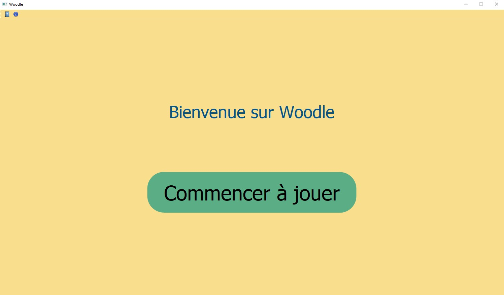
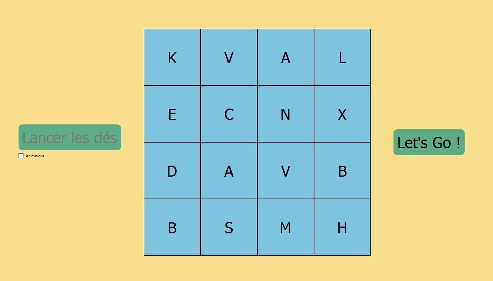
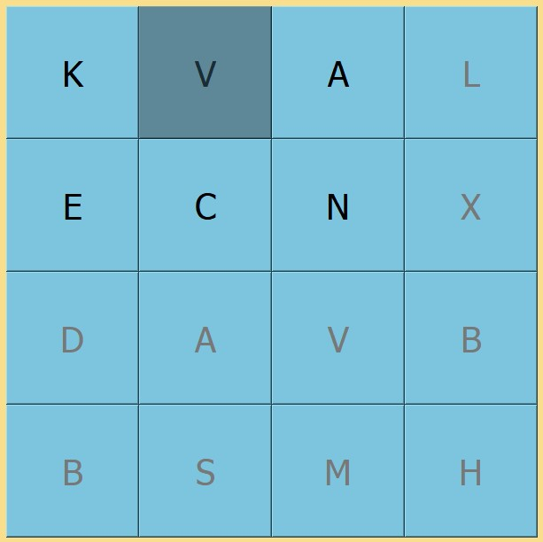
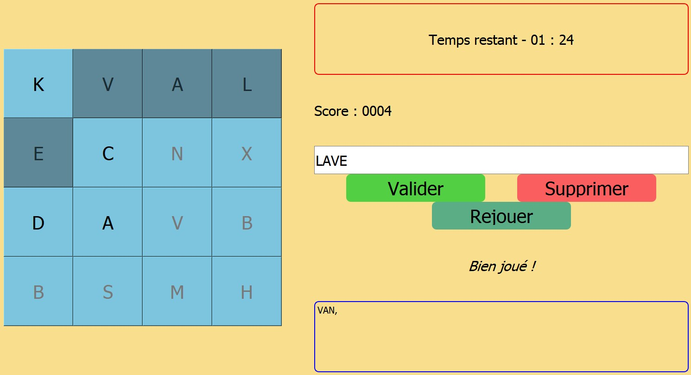

# Boogle
Boogle game (in french)

## Requirement
Library PyQt5

## How to play
1.  Click on "Commencer à jouer".

 

2.  Click on "Lancer les dés to generate a random grid of letters. Then "Let'Go".

 

3. You now have a certain period of time to find the most (French) words of 3 letters or more hidden in the grid. When you select only adjacent letters can be used to form a word.
 
 

4. Select "Valider" when you are sure about your word.

 

## How to win
Find as many words as possible to do in a grid. The longer the word, the more points it earns.

## How to run
Run the *Boggle.py* file along with all other files in the same folder.

## Context
This project was created as part of my studies in the 2nd year of my engineer school ESME Sudria.
***Rayane WAIDI*** - [My Linkdin](https://www.linkedin.com/in/rayane-waidi/). 
